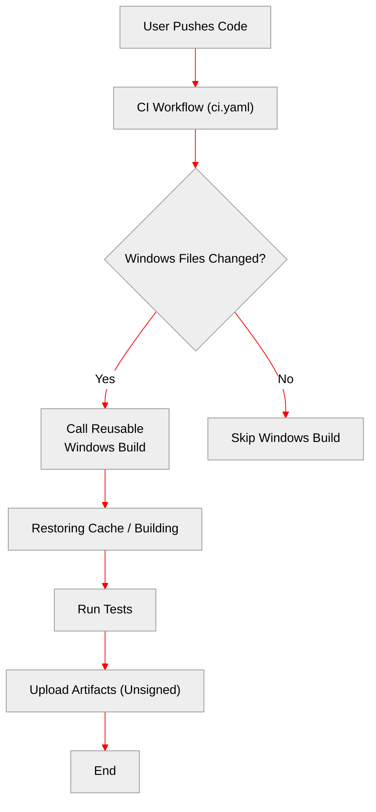
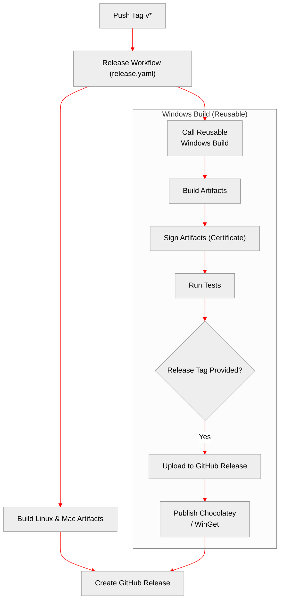

# Workflow Structure & Options

This document outlines the three main ways the Windows build workflow operates in the new structure.

## 1. Standard PR / Push Flow

**Trigger**: Push to a branch or Open/Update a Pull Request.

In this mode, the Windows build runs as a **check** to ensure code validity. It **does not** sign artifacts or publish them.

*   **Inputs**: Uses defaults (`sign_artifacts: false`, `choco_publish: false`).
*   **Permissions**: Inherits `read` permissions (safe for forks).

## 2. Release Process Flow

**Trigger**: Pushing a tag (e.g. `v3.12.0`).

In this mode, the Windows build is part of the official release pipeline. It **signs** the artifacts and **uploads** them to the GitHub Release.

*   **Inputs**: `sign_artifacts: true`, `choco_publish: true`, `winget_publish: true`.
*   **Permissions**: Inherits `write` permissions (required for upload).

## 3. Manual / Standalone Flow

**Trigger**: Manually running the workflow via GitHub Actions UI (`windows-build.yaml` or `release.yaml`).

> [!NOTE]
> The `reuse` mode (downloading pre-built artifacts from GCS) has been removed. The workflow now always builds from source.

### Option A: Trigger `windows-build.yaml` directly
Use this to test the Windows build logic in isolation.

*   **Inputs**:
    *   `release_tag`: If set (e.g., `0.0.1-test`), it will attempt to upload artifacts to a GitHub Release with this tag.
    *   `sign_artifacts`: Check to enable code signing (requires secrets).
    *   `choco_publish` / `winget_publish`: Check to test package publishing.
*   **Permissions**:
    *   This workflow works best for **compilation and test verification** (inputs left empty).
    *   **WARNING**: If you want to test **artifacts upload**, you must ensure the repository's "Workflow permissions" settings allow Read and Write, or the upload step will fail (as the local `permissions: write` block has been vetted out for CI compatibility).

### Option B: Trigger `release.yaml` (Recommended for Release Testing)
Use this to test the full release pipeline, including permissions and uploads.

*   **Trigger**: Select `Release` workflow -> Run workflow.
*   **Behavior**: It mimics a real tag push but allows you to skip parts or target a test tag. It explicitly grants `write` permissions to the Windows job, ensuring uploads work correctly without changing global repo settings.
*   **Inputs**:
    *   `build_windows`: Check to include the Windows build job.

## Testing Guidelines

| Goal | Workflow | Inputs | Notes |
| :--- | :--- | :--- | :--- |
| **Verify Compilation** | `windows-build` | All disabled | Fast check, no secrets needed. |
| **Verify Tests** | `ci.yaml` | (Automatic on PR) | Runs standard test suite. |
| **Test Release Upload** | `release.yaml` | `build_windows: true` | Safest way to test uploads. Creates draft/pre-release if tag unused. |
| **Test Windows Specifics** | `windows-build` | `release_tag: test` | **Requires** repo permission "Read and Write" enabled in Settings. |
