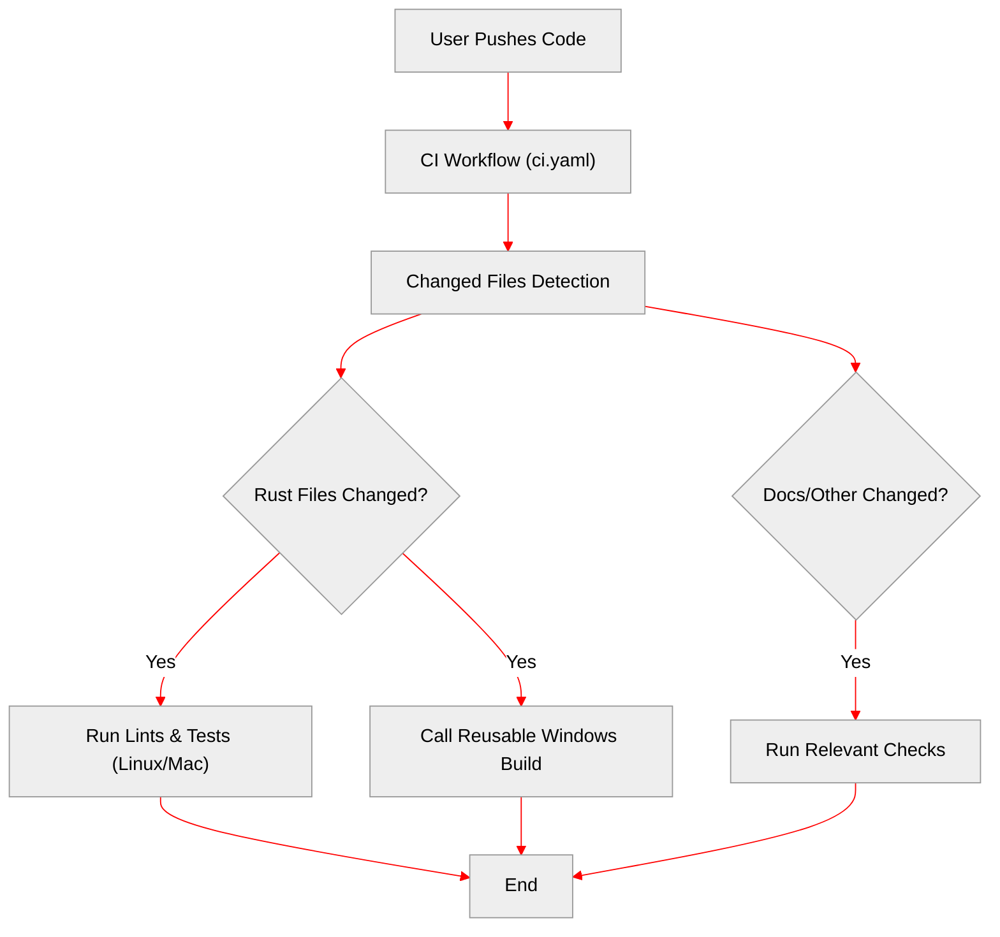
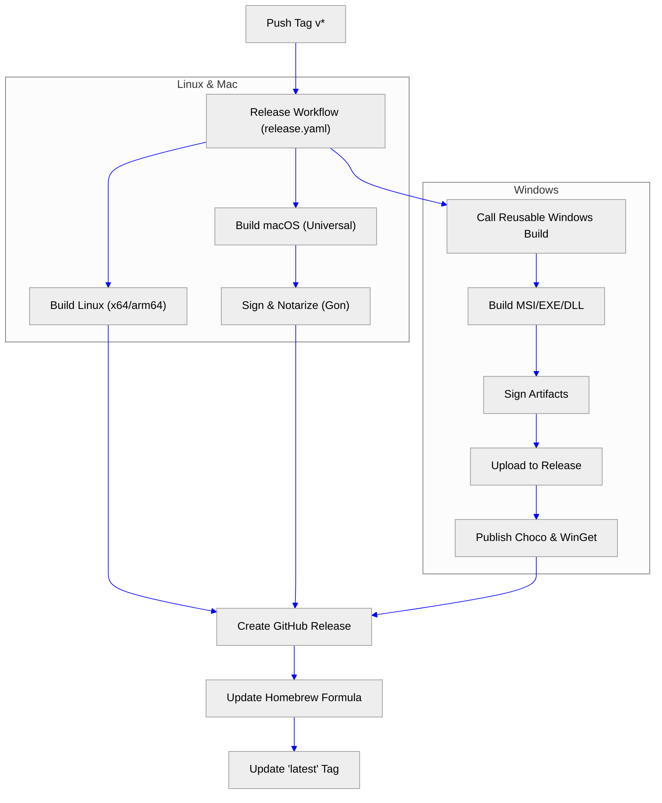

# Workflow Structure & Options

This document outlines the main workflows in this repository and how they interact to handle CI, Releases, and Windows builds.

## 1. CI Flow (`ci.yaml`)

**Trigger**: Push to a branch or Open/Update a Pull Request.

This workflow is the primary gatekeeper. It runs linting, unit tests, integration tests, and end-to-end tests.
It is optimized to only run necessary jobs based on changed files.

*   **Windows Build in CI**: It runs as a **check** to ensure code validity. It **does not** sign artifacts or publish them. It is triggered if any Rust code or Windows-specific scripts match the change patterns.

## 2. Release Process Flow (`release.yaml`)

**Trigger**: Pushing a tag (e.g. `1.2.3`).

This workflow handles the official release process. It builds signed artifacts for all platforms and publishes them.

### Key Components

1.  **Cross-Compilation**: Uses `cross` for Linux ARM64/x64 builds.
2.  **macOS Signing**: Uses `gon` to sign and notarize macOS binaries.
3.  **Windows Reusable Workflow**: The `windows-build.yaml` is called with `sign_artifacts: true` and publish flags enabled. It handles its own signing and uploading to the existing GitHub release.
4.  **Distribution**: Updates Homebrew tap and moves the `latest` tag upon success.

## 3. Manual / Test Flow

You can manually trigger workflows for testing purposes.

### testing `windows-build.yaml` in isolation

*   **Trigger**: Manually via GitHub Actions UI.
*   **Inputs**:
    *   `release_tag`: If set, tries to upload artifacts (requires Write permissions).
    *   `sign_artifacts`: Enable code signing.
    *   `choco_publish` / `winget_publish`: Test package publishing.

### Testing `release.yaml`

*   **Trigger**: Manually via GitHub Actions UI.
*   **Behavior**: It mimics a release but runs on the current branch.
*   **Note**: Ensure you understand that it might try to push Docker images or publish packages if not carefully fenced by conditionals (mostly protected by `github.event_name != 'workflow_dispatch'` checks for dangerous steps).
