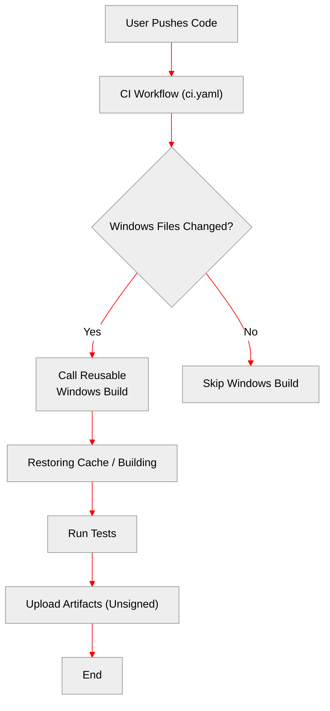
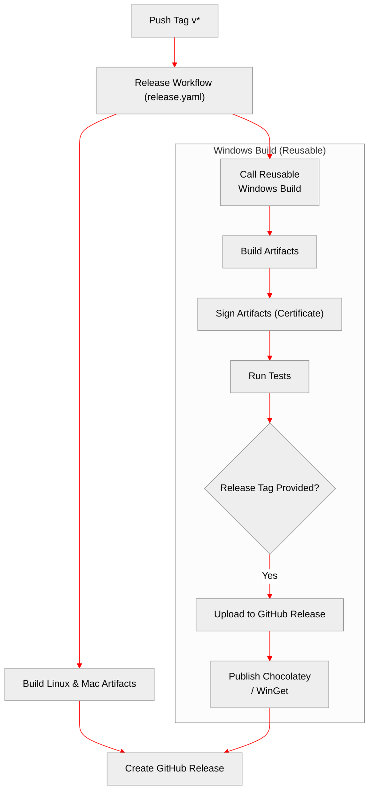
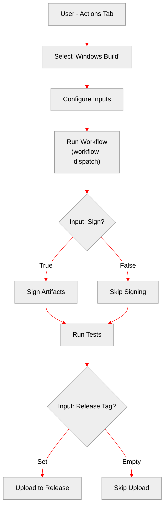

# Workflow Structure & Options

This document outlines the three main ways the Windows build workflow operates in the new structure.

## 1. Standard PR / Push Flow

**Trigger**: Push to a branch or Open/Update a Pull Request.

In this mode, the Windows build runs as a **check** to ensure code validity. It **does not** sign artifacts or publish them.

*   **Inputs**: Uses defaults (`sign_artifacts: false`, `choco_publish: false`).
*   **Permissions**: Inherits `read` permissions (safe for forks).

## 2. Release Process Flow

**Trigger**: Pushing a tag (e.g. `v3.12.0`).

In this mode, the Windows build is part of the official release pipeline. It **signs** the artifacts and **uploads** them to the GitHub Release.

*   **Inputs**: `sign_artifacts: true`, `choco_publish: true`, `winget_publish: true`.
*   **Permissions**: Inherits `write` permissions (required for upload).

## 3. Manual / Standalone Flow

**Trigger**: Manually running the workflow via GitHub Actions UI.

This gives you full control. You can use this to test the release process without pushing a tag, or to build specific artifacts for debugging.

*   **Inputs**: Fully configurable UI (Mode, Tag, Sign, Publish Choco, Publish WinGet).
*   **Permissions**: Uses `write` permissions by default (user triggered).
