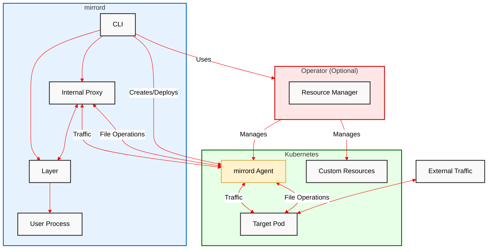
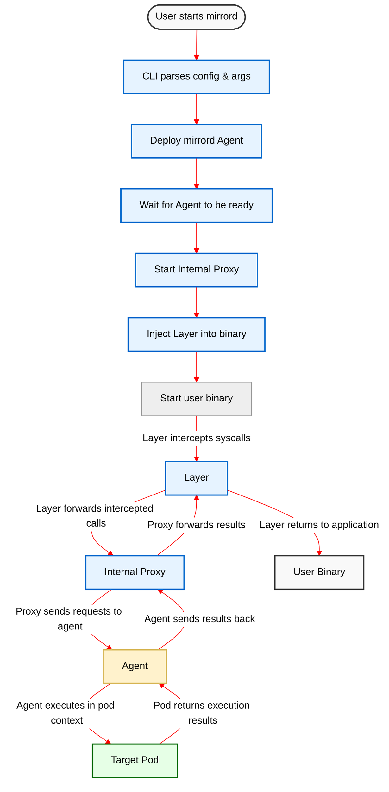

# Contributing

Before submitting pull request features, please discuss them with us first by opening an issue or a discussion.
We welcome new/junior/starting developers. Feel free to join to our [Discord channel](https://discord.gg/metalbear) for help and guidance.

If you would like to start working on an issue, please comment on the issue on GitHub, so that we can assign you to that
issue.

Make sure to take a look at the project's [style guide](STYLE.md).

# Contents

- [Getting Started](#getting-started)
- [Debugging mirrord](#debugging-mirrord)
- [New Hook Guidelines](#new-hook-guidelines)
- [Compiling on MacOs](#compiling-on-macos)
- [Adding new target types](#adding-new-target-types)
- [Testing the release workflow](#testing-the-release-workflow)
- [Architecture](#architecture)

# Getting Started

The following guide details the steps to setup a local development environment for mirrord and run the E2E tests.

### Prerequisites

- [GCC](https://gcc.gnu.org/) - only on Linux, GCC is needed for Go dynamic linking
- [Rust](https://www.rust-lang.org/)
- [NodeJS](https://nodejs.org/en/), [ExpressJS](https://expressjs.com/)
- [Python](https://www.python.org/), [Flask](https://flask.palletsprojects.com/en/2.1.x/), [FastAPI](https://fastapi.tiangolo.com/), [Uvicorn](https://www.uvicorn.org/)
- [Go](https://go.dev/)
- Kubernetes Cluster (local/remote)

### Setup a Kubernetes cluster

For E2E tests and testing mirrord manually you will need a working Kubernetes cluster. A minimal cluster can be easily setup locally using either of the following:

- [Minikube](https://minikube.sigs.k8s.io/)
- [Docker Desktop](https://www.docker.com/products/docker-desktop/)
- [Kind](https://kind.sigs.k8s.io/docs/user/quick-start/)

For the ease of illustration and testing, we will conform to using Minikube for the rest of the guide.

### Minikube

Download [Minikube](https://minikube.sigs.k8s.io/)

Start a Minikube cluster with preferred driver. Here we will use the Docker driver.

```bash
minikube start --driver=docker
```

### Prepare a cluster

 Build mirrord-agent Docker Image.

Make sure you're [logged in to GHCR](https://docs.github.com/en/packages/working-with-a-github-packages-registry/working-with-the-container-registry).

Then run:
```bash
docker buildx build -t test . --file mirrord/agent/Dockerfile
```

```bash
❯ docker images
REPOSITORY                                     TAG       IMAGE ID       CREATED         SIZE
test                                           latest    5080c20a8222   2 hours ago     300MB
```

> **Note:** mirrord-agent is shipped as a container image as mirrord creates a job with this image, providing it with
> elevated permissions on the same node as the impersonated pod.

Load mirrord-agent image to Minikube.

```bash
minikube image load test
```

Switch Kubernetes context to `minikube`.

```bash
kubectl config get-contexts
```

```bash
kubectl config use-context minikube
```

## E2E Tests

The E2E tests create Kubernetes resources in the cluster that kubectl is configured to use and then run sample apps
with the mirrord CLI. The mirrord CLI spawns an agent for the target on the cluster, and runs the test app, with the
layer injected into it. Some test apps need to be compiled before they can be used in the tests
([this should be automated in the future](https://github.com/metalbear-co/mirrord/issues/982)).

> **Note:** `//go:build linux` prevents certain Go test apps from being built on macOS. When using 
> `scripts/build_go_apps.sh`, make the change below so the script continues building all other apps.
> ```bash
> go build -o "$1.go_test_app" || echo "Failed to build $directory/$1.go_test_app"
> ```

The basic command to run the E2E tests is:
```bash
cargo test --package tests
```

However, when running on macOS a universal binary has to be created first:
```bash
scripts/build_fat_mac.sh
```

And then in order to use that binary in the tests, run the tests like this:
```bash
MIRRORD_TESTS_USE_BINARY=../target/universal-apple-darwin/debug/mirrord cargo test -p tests
```

If new tests are added, decorate them with `cfg_attr` attribute macro to define what the tests target.
For example, a test which only tests sanity of the ephemeral container feature should be decorated with
`#[cfg_attr(not(feature = "ephemeral"), ignore)]`

On Linux, running tests may exhaust a large amount of RAM and crash the machine. To prevent this, limit the number of concurrent jobs by running the command with e.g. `-j 4`

### IPv6

Some tests create a single-stack IPv6 service. They can only be run on clusters with IPv6 enabled.
In order to test IPv6 on a local cluster on macOS, you can use Kind:

1. `brew install kind`
2. ```shell
   cat >kind-config.yaml <<EOF
   kind: Cluster
   apiVersion: kind.x-k8s.io/v1alpha4
   networking:
     ipFamily: ipv6
     apiServerAddress: 127.0.0.1
   EOF
   ```
3. `kind create cluster --config kind-config.yaml`
4. When you run `kubectl get svc -o wide --all-namespaces` you should see IPv6 addresses.

In order to use an agent image from a local registry, you can load the image to kind's registry with:

```
kind load docker-image test:latest
```

In order to test on EKS, I used this blueprint: https://github.com/aws-ia/terraform-aws-eks-blueprints/tree/main/patterns/ipv6-eks-cluster

After creating the cluster, I had to give myself permissions to the K8s objects, I did that via the AWS console (in the browser).
Feel free to add instructions on how to make that "manual" step unnecessary.

IPv6 tests (they currently don't run in the CI):
- steal_http_ipv6_traffic
- connect_to_kubernetes_api_service_over_ipv6


### Cleanup

The Kubernetes resources created by the E2E tests are automatically deleted when the test exits. However, you can preserve resources from failed tests for debugging. To do this, set the `MIRRORD_E2E_PRESERVE_FAILED` variable to any value.

```bash
MIRRORD_E2E_PRESERVE_FAILED=y cargo test --package tests
```

All test resources share a common label `mirrord-e2e-test-resource=true`. To delete them, simply run:

```bash
kubectl delete namespaces,deployments,services -l mirrord-e2e-test-resource=true
```

## Integration Tests

The layer's integration tests test the hooks and their logic without actually using a Kubernetes cluster and spawning
an agent. The integration tests usually execute a test app and load the dynamic library of the layer into them. The
tests set the layer to connect to a TCP/IP address instead of spawning a new agent. The tests then have to simulate the
agent - they accept the layer's connection, receive the layers messages and answer them as the agent would.

Since they do not need to create Kubernetes resources and spawn agents, the integration tests complete much faster than
the E2E tests, especially on GitHub Actions.

Therefore, whenever possible we create integration tests, and only resort to E2E tests when necessary.

### Running the Integration Tests

Some test apps need to be compiled before they can be used in the tests
([this should be automated in the future](https://github.com/metalbear-co/mirrord/issues/982)).

The basic command to run the integration tests is:
```bash
cargo test --package mirrord-layer
```

However, when running on macOS a dylib has to be created first:
```bash
scripts/build_fat_mac.sh
```

And then in order to use that dylib in the tests, run the tests like this:
```bash
MIRRORD_TEST_USE_EXISTING_LIB=../../target/universal-apple-darwin/debug/libmirrord_layer.dylib cargo test -p mirrord-layer
```

On Apple Silicon, set `MIRRORD_MACOS_ARM64_LIBRARY` additionally to use the arm64 layer lib as well:
```bash
MIRRORD_TEST_USE_EXISTING_LIB=../../target/universal-apple-darwin/debug/libmirrord_layer.dylib \
MIRRORD_MACOS_ARM64_LIBRARY=../../target/aarch64-apple-darwin/debug/libmirrord_layer.dylib \
cargo test -p mirrord-layer
```

### Integration Tests logs and you

These tests will try writing the `mirrord-intproxy` logs to a file in `/tmp/intproxy_logs`
(the dir will be created if it doesn't exist), the file name should be the same as the test name,
e.g. `/tmp/intproxy_logs/node_close_application_1_Application__NodeFileOps.log`.
If log file creation fails, then you should see the logs in `stderr`.

When running these in CI, an artifact is produced (scroll to `Artifacts` which is under
the `Actions` -> `Summary` page) with all the test log files that could be created.

## Testing mirrord manually with a sample app.

From the root directory of the mirrord repository, create a new testing deployment and service:

```bash
kubectl apply -f sample/kubernetes/app.yaml
```

<details>
  <summary>sample/kubernetes/app.yaml</summary>

```yaml
apiVersion: apps/v1
kind: Deployment
metadata:
  name: py-serv-deployment
  labels:
    app: py-serv
spec:
  replicas: 1
  selector:
    matchLabels:
      app: py-serv
  template:
    metadata:
      labels:
        app: py-serv
    spec:
      containers:
        - name: py-serv
          image: ghcr.io/metalbear-co/mirrord-pytest:latest
          ports:
            - containerPort: 80
          env:
            - name: MIRRORD_FAKE_VAR_FIRST
              value: mirrord.is.running
            - name: MIRRORD_FAKE_VAR_SECOND
              value: "7777"

---
apiVersion: v1
kind: Service
metadata:
  labels:
    app: py-serv
  name: py-serv
spec:
  ports:
    - port: 80
      protocol: TCP
      targetPort: 80
      nodePort: 30000
  selector:
    app: py-serv
  sessionAffinity: None
  type: NodePort

```

</details>

Verify everything was created after applying the manifest

```bash
❯ kubectl get services
NAME         TYPE        CLUSTER-IP     EXTERNAL-IP   PORT(S)        AGE
kubernetes   ClusterIP   10.96.0.1      <none>        443/TCP        3h13m
py-serv      NodePort    10.96.139.36   <none>        80:30000/TCP   3h8m
❯ kubectl get deployments
NAME                 READY   UP-TO-DATE   AVAILABLE   AGE
py-serv-deployment   1/1     1            1           3h8m
❯ kubectl get pods
NAME                                 READY   STATUS    RESTARTS   AGE
py-serv-deployment-ff89b5974-x9tjx   1/1     Running   0          3h8m
```

### Build and run mirrord

To build this project, you will first need a [Protocol Buffer Compiler](https://grpc.io/docs/protoc-installation/) installed.

#### macOS
```bash
scripts/build_fat_mac.sh
```

#### Linux
```bash
cargo build
```

The binary is created at `./target/<platform>/debug/mirrord`

#### Run mirrord with a local process

Sample web server - `app.js` (present at `sample/node/app.mjs` in the repo)

<details>
  <summary>sample/node/app.mjs</summary>

```js
import { Buffer } from "node:buffer";
import { createServer } from "net";
import { open, readFile } from "fs/promises";

async function debug_file_ops() {
  try {
    const readOnlyFile = await open("/var/log/dpkg.log", "r");
    console.log(">>>>> open readOnlyFile ", readOnlyFile);

    let buffer = Buffer.alloc(128);
    let bufferResult = await readOnlyFile.read(buffer);
    console.log(">>>>> read readOnlyFile returned with ", bufferResult);

    const sampleFile = await open("/tmp/node_sample.txt", "w+");
    console.log(">>>>> open file ", sampleFile);

    const written = await sampleFile.write("mirrord sample node");
    console.log(">>>>> written ", written, " bytes to file ", sampleFile);

    let sampleBuffer = Buffer.alloc(32);
    let sampleBufferResult = await sampleFile.read(buffer);
    console.log(">>>>> read ", sampleBufferResult, " bytes from ", sampleFile);

    readOnlyFile.close();
    sampleFile.close();
  } catch (fail) {
    console.error("!!! Failed file operation with ", fail);
  }
}

// debug_file_ops();

const server = createServer();
server.on("connection", handleConnection);
server.listen(
  {
    host: "localhost",
    port: 80,
  },
  function () {
    console.log("server listening to %j", server.address());
  }
);

function handleConnection(conn) {
  var remoteAddress = conn.remoteAddress + ":" + conn.remotePort;
  console.log("new client connection from %s", remoteAddress);
  conn.on("data", onConnData);
  conn.once("close", onConnClose);
  conn.on("error", onConnError);

  function onConnData(d) {
    console.log("connection data from %s: %j", remoteAddress, d.toString());
    conn.write(d);
  }
  function onConnClose() {
    console.log("connection from %s closed", remoteAddress);
  }
  function onConnError(err) {
    console.log("Connection %s error: %s", remoteAddress, err.message);
  }
}

```

</details>

```bash
RUST_LOG=debug target/debug/mirrord exec -i test -l debug -c --target pod/py-serv-deployment-ff89b5974-x9tjx node sample/node/app.mjs
```
> **Note:** You need to change the pod name here to the name of the pod created on your system.


```
.
.
.
2022-06-30T05:14:01.592418Z DEBUG hyper::proto::h1::io: flushed 299 bytes
2022-06-30T05:14:01.657977Z DEBUG hyper::proto::h1::io: parsed 4 headers
2022-06-30T05:14:01.658075Z DEBUG hyper::proto::h1::conn: incoming body is empty
2022-06-30T05:14:01.661729Z DEBUG rustls::conn: Sending warning alert CloseNotify
2022-06-30T05:14:01.678534Z DEBUG mirrord_layer::sockets: getpeername hooked
2022-06-30T05:14:01.678638Z DEBUG mirrord_layer::sockets: getsockname hooked
2022-06-30T05:14:01.678713Z DEBUG mirrord_layer::sockets: accept hooked
2022-06-30T05:14:01.905378Z DEBUG mirrord_layer::sockets: socket called domain:30, type:1
2022-06-30T05:14:01.905639Z DEBUG mirrord_layer::sockets: bind called sockfd: 32
2022-06-30T05:14:01.905821Z DEBUG mirrord_layer::sockets: bind:port: 80
2022-06-30T05:14:01.906029Z DEBUG mirrord_layer::sockets: listen called
2022-06-30T05:14:01.906182Z DEBUG mirrord_layer::sockets: bind called sockfd: 32
2022-06-30T05:14:01.906319Z DEBUG mirrord_layer::sockets: bind: no socket found for fd: 32
2022-06-30T05:14:01.906467Z DEBUG mirrord_layer::sockets: getsockname called
2022-06-30T05:14:01.906533Z DEBUG mirrord_layer::sockets: getsockname: no socket found for fd: 32
2022-06-30T05:14:01.906852Z DEBUG mirrord_layer::sockets: listen: success
2022-06-30T05:14:01.907034Z DEBUG mirrord_layer::tcp: handle_listen -> listen Listen {
    fake_port: 51318,
    real_port: 80,
    ipv6: true,
    fd: 32,
}
Server listening on port 80
```

Send traffic to the Kubernetes Pod through the service. On Linux, run the following command:

```bash
curl $(minikube service py-serv --url)
```

On macOS, run the command below and keep the terminal open.

```bash
minikube service py-serv --url
```

Open another terminal and send traffic with `curl` to the service URL displayed by `minikube`.

Check the traffic was received by the local process

```bash
.
.
.
2022-06-30T05:17:31.877560Z DEBUG mirrord_layer::tcp: handle_incoming_message -> message Close(
    TcpClose {
        connection_id: 0,
    },
)
2022-06-30T05:17:31.877608Z DEBUG mirrord_layer::tcp_mirror: handle_close -> close TcpClose {
    connection_id: 0,
}
2022-06-30T05:17:31.877655Z DEBUG mirrord_layer::tcp: handle_incoming_message -> handled Ok(
    (),
)
2022-06-30T05:17:31.878193Z  WARN mirrord_layer::tcp_mirror: tcp_tunnel -> exiting due to remote stream closed!
2022-06-30T05:17:31.878255Z DEBUG mirrord_layer::tcp_mirror: tcp_tunnel -> exiting
OK - GET: Request completed
```

# Debugging mirrord

## mirrord console

Debugging mirrord can get hard since we're running from another app flow, so the fact we're debugging might affect the program and make it unusable/buggy (due to sharing stdout with scripts/other applications).

The recommended way to do it is to use `mirrord-console`. It is a small application that receives log information from different mirrord instances and prints it, controlled via `RUST_LOG` environment variable.

To use mirrord console, run it:
`cargo run --bin mirrord-console --features binary`

Then run mirrord with the environment variable:
`MIRRORD_CONSOLE_ADDR=127.0.0.1:11233`

## Debugging the Internal Proxy (`intproxy`)

To see logs from the internal proxy, use the [mirrord console](#mirrord-console).

To debug it with a debugger:

1. Add
   ```Rust
       tokio::time::sleep(Duration::from_secs(20)).await;
   ```
   to [somewhere](https://github.com/metalbear-co/mirrord/blob/fa2af7f1e77a9254fb0908be40b0dae5da53d298/mirrord/cli/src/internal_proxy.rs#L145) in the start of the intproxy code.
2. Set breakpoints in vscode in the relevant lines of the intproxy code.
3. Build mirrord.
4. Run mirrord.
5. Attach a debugger in vscode to the inproxy process. On macOS you can do that with `Cmd` + `Shift` + `P` -> `LLDB: Attach to Process...` -> type `intproxy` and choose the `mirrord intproxy` process. The sleep you added at the start of the intproxy is time for you to attach the debugger.

## Retrieving Agent Logs

You can change the minimum severity of logs emitted by the agent by setting `agent.log_level` in the mirrord config
file, for example:
```json
"agent": {
	"log_level": "mirrord=trace"
}
```

By default, the agent's pod will complete and disappear shortly after the agent exits. In order to be able to retrieve
the agent's logs after it crashes, set the agent's pod's TTL to a comfortable number of seconds. This configuration can
be specified either as a command line argument (`--agent-ttl`), environment variable (`MIRRORD_AGENT_TTL`), or in a
configuration file:
```toml
[agent]
ttl = 30
```

Then, when running with some reasonable TTL, you can retrieve the agent log like this:
```bash
kubectl logs -l app=mirrord --tail=-1 | less -R
```

This will retrieve the logs from all running mirrord agents, so it is only useful when just one agent pod exists.

If there are currently multiple agent pods running on your cluster, you would have to run
```bash
kubectl get pods
```
and find the name of the agent pod you're interested in, then run

```bash
kubectl logs <YOUR_POD_NAME> | less -R
```

where you would replace `<YOUR_POD_NAME>` with the name of the pod.

# New Hook Guidelines

Adding a feature to mirrord that introduces a new hook (file system, network) can be tricky and there are a lot of edge cases we might need to cover.

In order to have a more structured approach, here's the flow you should follow when working on such a feature.

1. Start with the use case. Write an example use case of the feature, for example "App needs to read credentials from a file".
2. Write a minimal app that implements the use case - so in the case of our example, an app that reads credentials from a file. Start with either Node or Python as those are most common.
3. Figure out what functions need to be hooked in order for the behavior to be run through the mirrord-agent instead of locally. We suggest using `strace`.
4. Write a doc on how you would hook and handle the cases, for example:
    1. To implement use case "App needs to read credentials from a file*"
    2. I will hook `open` and `read` handling calls only with flags O_RDONLY.
    3. Once `open` is called, I'll send a blocking request to the agent to open the remote file, returning the return code of the operation.
    4. Create an fd using `memfd`. The result will be returned to the local app, and if successful we'll save that fd into a HashMap that matches between local fd and remote fd/identifier.
    5. When `read` is called, I will check if the fd being read was previously opened by us, and if it is we'll send a blocking `read` request to the agent. The result will be sent back to the caller.
    6. And so on.
5. This doc should go later on to our mirrord docs for advanced developers so people can understand how stuff works
6. After approval, you can start implementing. As part of the implementation you need to add E2E tests (in the `tests`
   crate). For each new hook, please test:
    1. A call that should be sent to the agent. Make sure it has a result that is distinguishable from the result of
       performing that operation locally.
    2. A call that should be bypassed. Make sure the result of the operation proves it happened locally. Please test
       different reasons for bypassing. E.g. for file operations, make a call with a relative path, and make a call
       with a path that is configured to be local. If it's easier for you, you can test bypassing in an integration
       test of mirrord-layer (under mirrord/layer/tests).
    3. If the configuration supports mappings that are relevant for this hook, add test cases with those mappings,
       and test that the mappings take effect correctly. E.g. for file operations test with a path mapping.


# Compiling on MacOS

The `mirrord-agent` crate makes use of the `#[cfg(target_os = "linux")]` attribute to allow the whole repo to compile on MacOS when you run `cargo build`.

To enable `mirrord-agent` code analysis with rust-analyzer:
1. Install additional targets
```sh
rustup target add x86_64-unknown-linux-gnu
rustup target add aarch64-apple-darwin
rustup target add x86_64-apple-darwin
rustup target add aarch64-unknown-linux-gnu
```
2. Add additional targets to your local `.cargo/config.toml` block:
```toml
[build]
target = [
    "aarch64-apple-darwin",
    "x86_64-apple-darwin",
    "x86_64-unknown-linux-gnu",
    "aarch64-unknown-linux-gnu",
]
```

If you're using rust-analyzer VSCode extension, put this block in `.vscode/settings.json` as well:
```json
{
    "rust-analyzer.check.targets": [
        "aarch64-apple-darwin",
        "x86_64-apple-darwin",
        "x86_64-unknown-linux-gnu",
        "aarch64-unknown-linux-gnu"
    ]
}
```

You can use `cargo-zigbuild` to run `cargo check` or `clippy` on the agent's code on macOS.

`cargo check`

```shell
cargo-zigbuild check -p mirrord-agent --target x86_64-unknown-linux-gnu
```

`clippy` only for the agent

```shell
cargo-zigbuild clippy --target x86_64-unknown-linux-gnu -p mirrord-agent -- -Wclippy::indexing_slicing -D warnings
```

`clippy` for all code:

```shell
cargo-zigbuild clippy --lib --bins --all-features --target x86_64-unknown-linux-gnu --tests -- -Wclippy::indexing_slicing -D warnings
```

If it doesn't work, try updating `cargo-zigbuild`
(`cargo install cargo-zigbuild` or maybe `cargo install cargo-zigbuild --force`)
or via `homebrew` if it was installed via homebrew.

# Adding new target types

Adding a new target type for mirrord requires changes in:

1. `mirrord-config` crate - parsing the target from the user config;
2. `mirrord-cli` crate - verifying the user config;
3. `mirrord-kube` crate - resolving the target to the Kubernetes resource;
4. `mirrord-operator` crate - defining operator's `ClusterRole`;
5. `test` crate - testing `mirrord ls` command

# Testing the release workflow

The standard CI workflow runs when you open a new PR, but in some cases you'll also need to test that the release workflow works properly.

From [the release workflow definition](/.github/workflows/release.yaml):
>   Running from workflow dispatch (AKA manual) will not publish anything. This is intended for testing changes to this flow.

To test the release workflow:

1. Push your changes to a branch on the main mirrord repo (not a fork)
2. Go to [the release workflow section under the Actions tab on the mirrord repo](https://github.com/metalbear-co/mirrord/actions/workflows/release.yaml)
3. On the right of the "This workflow has a `workflow_dispatch` event trigger." banner, select the dropdown labelled "Run workflow"
4. Select the branch with your changes and run

You can check the run as it progresses and download the completed artifacts from the "Summary" tab in the sidebar.

## Changing the release on MacOS

If you're making changes to the release and/or CI workflows for MacOS specifically - for example changing how the universal binary is created, you need to ensure that [the script for building the universal binary](/scripts/build_fat_mac.sh) that is run manually when developing has also been updated if necessary.

## Architecture

A high level view of mirrord.



### Flow

What a user executing their app with mirrord looks like.


