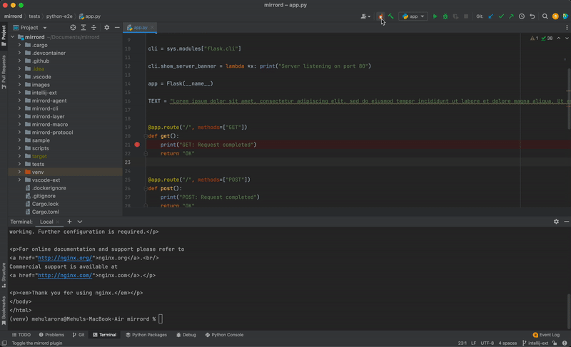

<div align="center">


</div>

<div align="center">


</div>

[](https://discord.gg/J5YSrStDKD)


[](https://twitter.com/metalbearco)

mirrord lets developers run local processes in the context of their cloud environment. It’s meant to provide the benefits of running your service on a cloud environment (e.g. staging) without actually going through the hassle of deploying it there, and without disrupting the environment by deploying untested code.. It comes as a [Visual Studio Code](https://code.visualstudio.com/) extension, an [IntelliJ](https://www.jetbrains.com/products/) plugin and a CLI tool. You can read more about it [here](https://mirrord.dev/docs/overview/introduction/).

## Getting Started
- [VS Code Extension](#vs-code-extension)
- [IntelliJ Plugin](#intellij-plugin)
- [CLI Tool](#cli-tool)
> mirrord uses your machine's default kubeconfig for access to the Kubernetes API.

---
## VS Code Extension
### Installation
Get the extension [here](https://marketplace.visualstudio.com/items?itemName=MetalBear.mirrord).

### How To Use

* Click "Enable mirrord" on the status bar
* Start debugging your project
* Choose pod to mirror traffic from
* The debugged process will be plugged into the selected pod by mirrord

<p align="center">
  
</p>

---
## IntelliJ Plugin
### Installation
Get the plugin [here](https://plugins.jetbrains.com/plugin/19772-mirrord).

### How To Use

* Click the mirrord icon in the Navigation Toolbar
* Start debugging your project
* Choose a namespace and pod to impersonate
* The debugged process will be plugged into the selected pod by mirrord

<p align="center">
  
</p>

---
## CLI Tool
### Installation
```sh
curl -fsSL https://raw.githubusercontent.com/metalbear-co/mirrord/main/scripts/install.sh | bash
```

* Windows isn't currently supported (you can use WSL)

### How To Use
```sh
mirrord exec <process command> --pod-name <name of the pod to impersonate>
```
e.g. 

```sh
mirrord exec node app.js --pod-name my-pod
```

---

## How It Works
mirrord works by letting you select a pod to plug into (mirror incoming traffic from, send outgoing traffic through, read and write files to, and read environment variables from). It launches a privileged pod on the same node which enters the namespace of the selected pod.
<p align="center">

</p>
## Contributing
Contributions are much welcome. Start by checking out [issues](https://github.com/metalbear-co/mirrord/issues).
If you wish to work an issue, please comment so you can be assigned.


## Development
Read our development guide [here](https://mirrord.dev/docs/developer/testing/).


## Help & Community 🎉✉️

Join our [Discord Server](https://discord.gg/J5YSrStDKD) for questions, support and fun.

## Code of Conduct
We take our community seriously and we are dedicated to providing a safe and welcoming environment for everyone.
Please take a few minutes to review our [Code of Conduct](./CODE_OF_CONDUCT.md).

## License
[MIT](./LICENSE)
