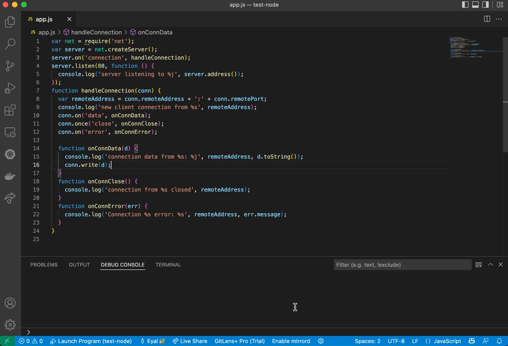

<p align="center">


</p>

mirrord lets you easily mirror traffic from your Kubernetes cluster to your development environment. It comes as both [Visual Studio Code](https://code.visualstudio.com/) extension and a CLI tool.


## Install (macOS/Linux)
```sh
curl -fsSL https://raw.githubusercontent.com/metalbear-co/mirrord/main/scripts/install.sh | bash
```

* Windows isn't supported currently (you can use WSL)

## Getting Started
Check our [quick start](https://mirrord.dev/docs/prologue/quick-start/)

## Contributing
Contributions are welcome via PRs.


## Help & Community 🎉✉️

Join our [Discord Server](https://discord.gg/J5YSrStDKD) for questions, support and fun. 

## Code of Conduct
We take our community seriously and we are dedicated to providing a safe and welcoming environment for everyone.
Please take a few minutes to review our [Code of Conduct](./CODE_OF_CONDUCT.md).

## License
[MIT](./LICENSE)