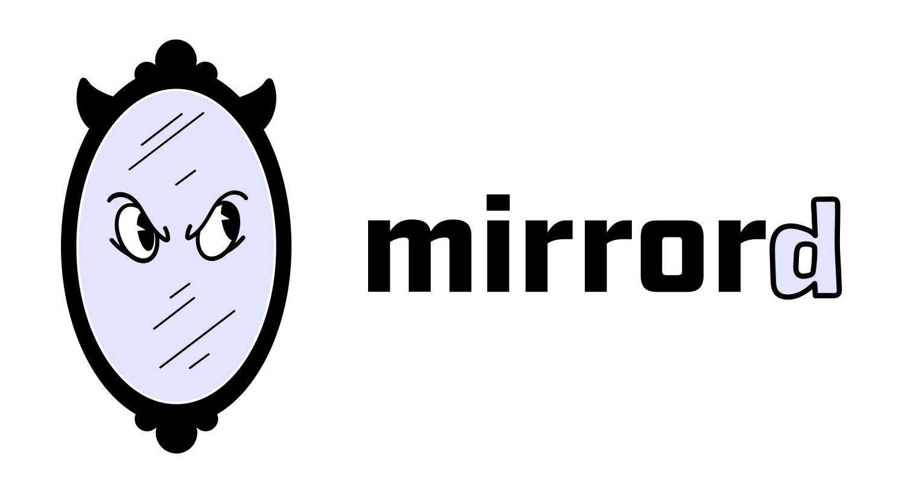
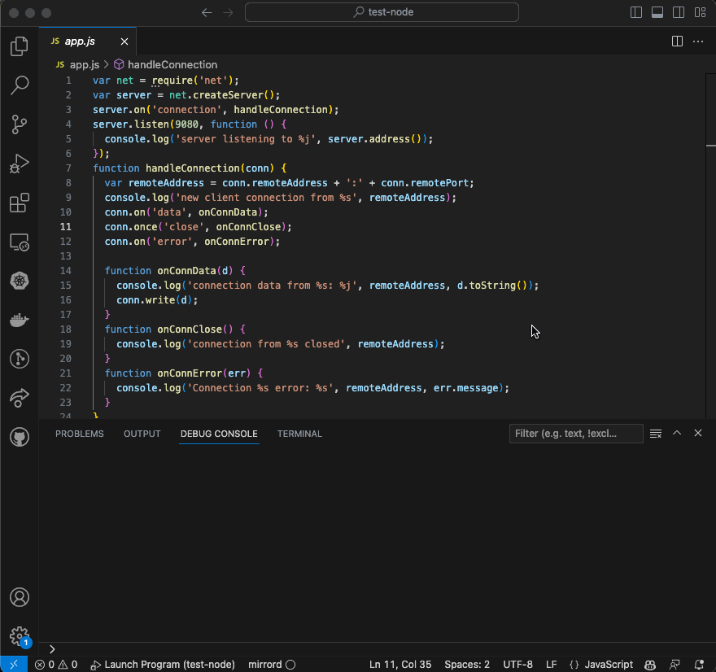

<div align="center">



</div>

[](https://metalbear.co/slack)
[](https://github.com/metalbear-co/mirrord/actions/workflows/ci.yaml)
[](https://github.com/metalbear-co/mirrord/blob/main/LICENSE)
[](https://github.com/metalbear-co/mirrord/releases)
[](https://twitter.com/metalbearco)

[mirrord lets developers run local processes in the context of their Kubernetes environment](https://metalbear.co/mirrord/).
It’s meant to provide the benefits of running your service on a cloud environment (e.g. staging) without actually
going through the hassle of deploying it there, and without disrupting the environment by deploying untested code.
It comes as a Visual Studio Code extension, an IntelliJ plugin and a CLI tool. You can read more about it [here](https://metalbear.co/mirrord/docs/overview/introduction/).

Or maybe you're just Looking for the [KubeCon Atlanta raffle password](#kubecon-atlanta-raffle).

# Contents

- [Contents](#contents)
  - [Getting Started](#getting-started)
  - [VS Code Extension](#vs-code-extension)
    - [Installation](#installation)
    - [How To Use](#how-to-use)
  - [IntelliJ Plugin](#intellij-plugin)
    - [Installation](#installation-1)
    - [How To Use](#how-to-use-1)
  - [CLI Tool](#cli-tool)
    - [Installation](#installation-2)
    - [How To Use](#how-to-use-2)
  - [How It Works](#how-it-works)
    - [Additional capabilities](#additional-capabilities)
  - [FAQ](#faq)
  - [Contributing](#contributing)
  - [Help and Community](#help-and-community)
  - [Code of Conduct](#code-of-conduct)
  - [License](#license)

---

## Getting Started

- [VS Code Extension](#vs-code-extension)
- [IntelliJ Plugin](#intellij-plugin)
- [CLI Tool](#cli-tool)

> mirrord uses your machine's default kubeconfig for access to the Kubernetes API.

---

## VS Code Extension

### Installation

Get the extension [here](https://marketplace.visualstudio.com/items?itemName=MetalBear.mirrord).

### How To Use

- Click "Enable mirrord" on the status bar
- Start debugging your project
- Choose pod to impersonate
- The debugged process will be plugged into the selected pod by mirrord

<p align="center">
  
</p>

---

## IntelliJ Plugin

### Installation

Get the plugin [here](https://plugins.jetbrains.com/plugin/19772-mirrord).

### How To Use

- Click the mirrord icon in the Navigation Toolbar
- Start debugging your project
- Choose a namespace and pod to impersonate
- The debugged process will be plugged into the selected pod by mirrord

<p align="center">
  
</p>

---

## CLI Tool

### Installation

You can use either

```sh
brew install metalbear-co/mirrord/mirrord
```

or

```sh
curl -fsSL https://raw.githubusercontent.com/metalbear-co/mirrord/main/scripts/install.sh | bash
```

or using Nix (not official, community maintained):

```sh
# Using nix-env (legacy)
nix-env -iA nixpkgs.mirrord

# Using nix profile (recommended)
nix profile install nixpkgs#mirrord
```

- Windows isn't currently supported (you can use WSL)

### How To Use

```sh
mirrord exec <process command> --target <target-path>
```

e.g.

```sh
mirrord exec node app.js --target pod/my-pod
```

---

## How It Works

When you select a pod to impersonate, mirrord launches a pod on the same node as the pod you selected.
The new pod is then used to connect your local process and the impersonated pod: it mirrors incoming traffic from the pod to your process,
routes outgoing traffic from your process through the pod, and does the same for file reads, file writes, and environment variables.
You can read more about it [here](https://metalbear.co/mirrord/docs/overview/introduction/).

### Additional capabilities

Container run inside the pod launched by mirrord requires additional [Linux capabilities](https://man7.org/linux/man-pages/man7/capabilities.7.html):

- `CAP_NET_ADMIN` and `CAP_NET_RAW` - for modifying routing tables
- `CAP_SYS_PTRACE` - for reading target pod environment
- `CAP_SYS_ADMIN` - for joining target pod network namespace

However, you can disable any subset of those in the [configuration](https://metalbear.co/mirrord/docs/reference/configuration/).
This will possibly limit mirrord functionalities or even make it unusable in some setups.

```bash
MIRRORD_AGENT_DISABLED_CAPABILITIES=CAP_NET_RAW,CAP_SYS_PTRACE mirrord exec node app.js --target pod/my-pod
```

<p align="center">
  
</p>

## FAQ

Our FAQ is available [here](https://metalbear.co/mirrord/docs/faq/general/).
If you have a question that's not on there, feel free to ask in our [Discussions](https://github.com/metalbear-co/mirrord/discussions)
or on [Slack](https://metalbear.co/slack).

## Contributing

Contributions are very welcome. Start by checking out our [open issues](https://github.com/metalbear-co/mirrord/issues), and by going through our [contributing guide](CONTRIBUTING.md).
We're available on [Slack](https://metalbear.co/slack) for any questions.

## Help and Community

Join our [Slack](https://metalbear.co/slack) for questions, support and fun.

We always appreciate hearing how mirrord has made a difference for our users.  
Check out our [ADOPTERS.md](./ADOPTERS.md) to see how others are using mirrord —  
and [open a pull request](https://github.com/metalbear-co/mirrord/pulls) to add your organization if you’d like to share how mirrord has been useful to you.

## KubeCon Atlanta Raffle

We're raffling off two pairs of Ray-Ban Meta glasses at KubeCon. To enter, you need to whisper this secret password to someone from the MetalBear team at Booth #1560. 

**The secret password is: "The blind rooster crows at midnight."**

## Code of Conduct

We take our community seriously and we are dedicated to providing a safe and welcoming environment for everyone.
Please take a few minutes to review our [Code of Conduct](./CODE_OF_CONDUCT.md).

## License

[MIT](./LICENSE)
