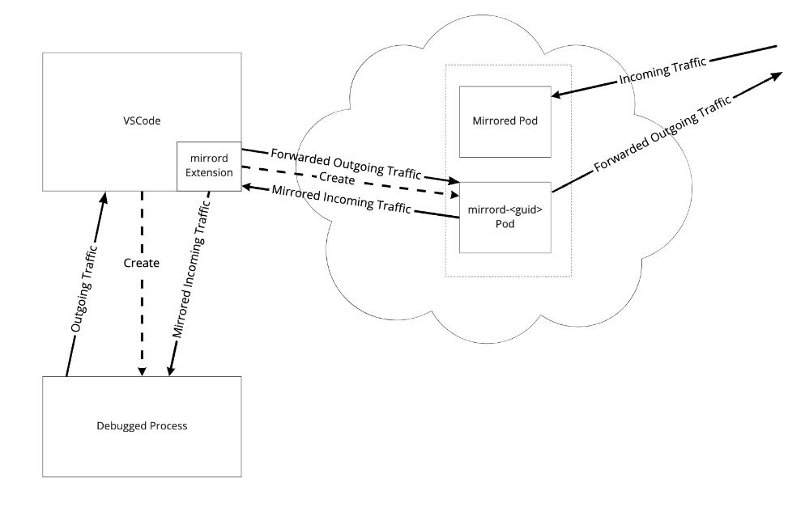
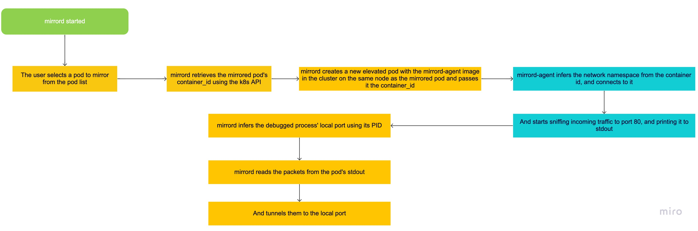

  

<h1 align="center">mirrord</h1>

A [Visual Studio Code](https://code.visualstudio.com/) extension that lets you easily mirror traffic from your Kubernetes cluster to your development environment.

When you start debugging, mirrord will prompt you to select a pod to mirror traffic from. It will then mirror all traffic from that pod to the process you're debugging.

## How to use

* Start debugging your project.
* Click "Start mirrord" on the status bar.
* Choose pod to mirror traffic from.
* Click stop when you wish to finish (or stop debugging).

  

## How it works

  

  

<!--  -->
      
<i>Icon Credit: flaticon.com</i>
