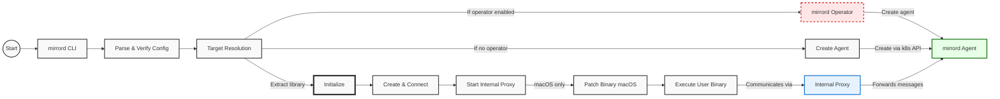

```mermaid
flowchart LR
    %% Nodes
    Start((Start))
    CLI[mirrord CLI]
    Config[Parse & Verify Config]
    Target[Target Resolution]
    Init[Initialize]
    CreateAgent[Create Agent]
    Connect[Create & Connect]
    ProxyStart[Start Internal Proxy]
    Patch[Patch Binary macOS]
    Exec[Execute User Binary]
    IntProxy[Internal Proxy]
    Agent[mirrord Agent]
    Operator[mirrord Operator]

    %% Styles
    classDef default fill:#f9f9f9,stroke:#333,stroke-width:2px
    classDef proxy fill:#e6f3ff,stroke:#0066cc,stroke-width:2px
    classDef agent fill:#e6ffe6,stroke:#006600,stroke-width:2px
    classDef operator fill:#ffe6e6,stroke:#cc0000,stroke-width:2px,stroke-dasharray: 5 5
    classDef init fill:#f9f9f9,stroke:#333,stroke-width:4px

    %% Apply styles
    class IntProxy proxy
    class Agent agent
    class Operator operator
    class Init init

    %% Flow
    Start --> CLI
    CLI --> Config
    Config --> Target
    Target --> |If operator enabled| Operator
    Operator --> |Create agent| Agent
    Target --> |If no operator| CreateAgent
    CreateAgent --> |Create via k8s API| Agent
    Target --> |Extract library| Init
    Init --> Connect
    Connect --> ProxyStart
    ProxyStart --> |macOS only| Patch
    Patch --> Exec
    Exec --> |Communicates via| IntProxy
    IntProxy --> |Forwards messages| Agent
```
