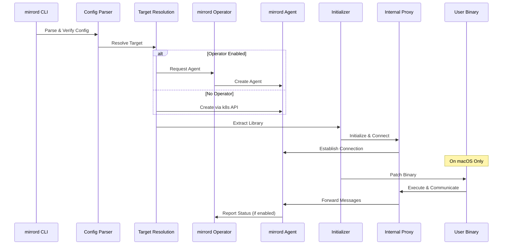

# mirrord-cli
mirrord-cli is the actual binary that users use to run mirrord. The client helps you execute processes with mirrord injected to it.
Right now injection is done using `LD_PRELOAD` on Linux and `DYLD_INSERT_LIBRARIES` on macOS.

## Usage
`mirrord exec --pod-name <POD_NAME> <BINARY> [BINARY_ARGS..]`

## Compatibility
### Linux
`LD_PRELOAD` works only on dynamically linked binaries, so static binaries won't work. Most development use cases are dynamic binaries, so it should be okay.
We do have plan to support static binaries, so let us know if you encountered a use case that isn't covered.

### macOS
`DYLD_INSERT_LIBRARIES` works on "unprotected" binaries, which are most development binaries anyway. To be more specific, the following use cases won't work:

* setuid and/or setgid bits are set
* restricted by entitlements
* restricted segment

[Source](https://theevilbit.github.io/posts/dyld_insert_libraries_dylib_injection_in_macos_osx_deep_dive/)

Please let us know if you encountered a use case where it doesn't work for you, of whether it's documented that it isn't supported, so we know there's demand to implement that use case.

## Diagrams

### `mirrord exec`

```mermaid
flowchart LR
    %% Nodes
    Start((Start))
    CLI[mirrord CLI]
    Config[Parse & Verify Config]
    Target[Target Resolution]
    Init[Initialize]
    CreateAgent[Create Agent]
    Connect[Create & Connect]
    ProxyStart[Start Internal Proxy]
    Patch[Patch Binary macOS]
    Exec[Execute User Binary]
    IntProxy[Internal Proxy]
    Agent[mirrord Agent]
    Operator[mirrord Operator]

    %% Styles
    classDef default fill:#f9f9f9,stroke:#333,stroke-width:2px
    classDef proxy fill:#e6f3ff,stroke:#0066cc,stroke-width:2px
    classDef agent fill:#e6ffe6,stroke:#006600,stroke-width:2px
    classDef operator fill:#ffe6e6,stroke:#cc0000,stroke-width:2px,stroke-dasharray: 5 5
    classDef init fill:#f9f9f9,stroke:#333,stroke-width:4px

    %% Apply styles
    class IntProxy proxy
    class Agent agent
    class Operator operator
    class Init init

    %% Flow
    Start --> CLI
    CLI --> Config
    Config --> Target
    Target --> |If operator enabled| Operator
    Operator --> |Create agent| Agent
    Target --> |If no operator| CreateAgent
    CreateAgent --> |Create via k8s API| Agent
    Target --> |Extract library| Init
    Init --> Connect
    Connect --> ProxyStart
    ProxyStart --> |macOS only| Patch
    Patch --> Exec
    Exec --> |Communicates via| IntProxy
    IntProxy --> |Forwards messages| Agent

    %% Note: Create Agent, mirrord Operator, and Initialize steps happen in parallel
    subgraph Parallel
        direction LR
        CreateAgent
        Operator
        Init
    end
```

### `mirrord exec` (Sequence Diagram)

